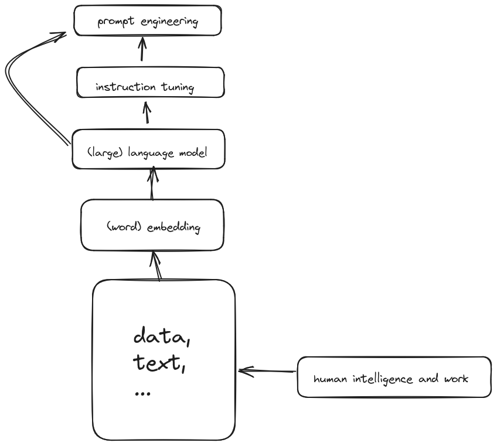
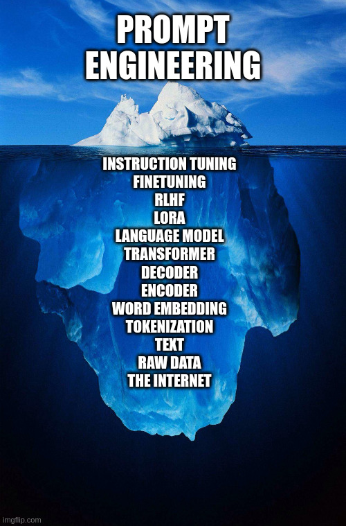
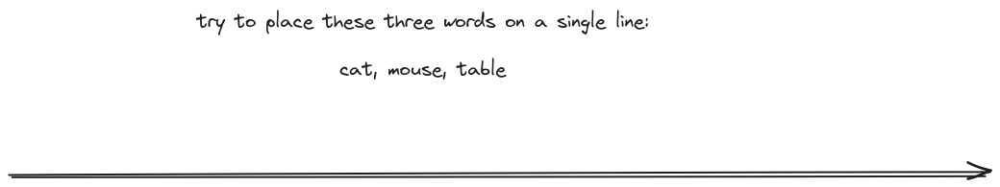
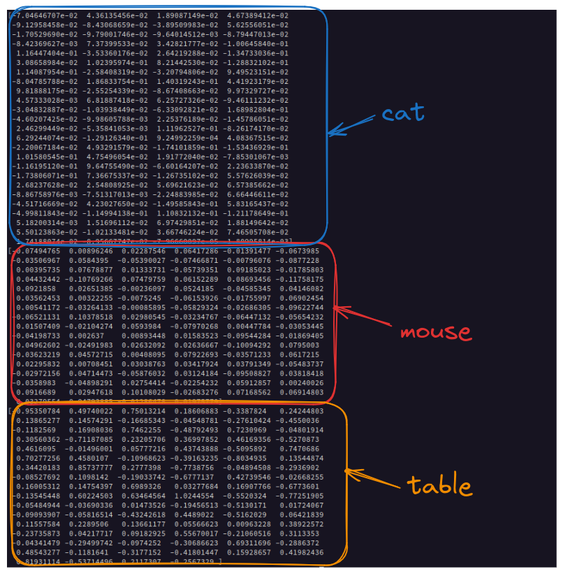

# UBL Writing Day 2024 Prompt Engineering

> Input session on 2024-02-29, Leipzig University Library, [Martin
> Czygan](mailto:martin.czygan@gmail.com), software developer, author and data
> engineer

[Random voice](https://news.ycombinator.com/item?id=34885491) on the internet:
"The prompt engineers will be the first self-proclaimed engineers to be
replaced by AI."

> LARGE LANGUAGE MODELS ARE HUMAN-LEVEL PROMPT ENGINEERS
> [2211.01910.pdf](https://arxiv.org/pdf/2211.01910.pdf)

## About Me

<!-- [](https://en.wikipedia.org/wiki/CP/M) -->

* Software Developer at [Leipzig University Library](https://ub.uni-leipzig.de), Open Data Engineer at [Internet Archive](https://archive.org), working on [Internet Archive Scholar](https://en.wikipedia.org/wiki/Internet_Archive_Scholar)
* Misc: consultant,
  [author](https://scholar.google.com/citations?user=7gueY4EAAAAJ), open source
[contributor](https://github.com/miku), community
[organizer](https://golangleipzig.space/), former Lecturer at [Lancaster
University](https://www.lancasterleipzig.de/) Leipzig
* curious about computers since about 1985 ([pic](https://en.wikipedia.org/wiki/CP/M) related), about machine learning since about [2011](http://web.archive.org/web/20110816035332/ai-class.com)

## A perspective on "AI"

* "AI" is mostly "ML"
* testing [open](https://arxiv.org/pdf/2302.04844.pdf) models, mostly - models for which the research and development process is (at least somewhat) documented

![Running Sosaka/Alpaca-native-4bit-ggml [9c1bb480] from 2023-03-21 on a 2018 laptop w/ i7-8550u CPU and w/o GPU, recorded 2023-04-19](static/578575.gif)

> But there is frustration in the science community over OpenAI's secrecy
> around how the model was trained and what data were used, and how GPT-4
> actually works. "**All of these closed-source models, they are essentially dead
> ends in science**," says [Sasha Luccioni](https://www.sashaluccioni.com/), a research scientist specializing in
> climate at HuggingFace, an open-source AI cooperative. --
> [GPT-4 IS HERE: WHAT SCIENTISTS THINK](http://www.hajim.rochester.edu/che/assets/pdf/gpt-4-is-here-what-scientists-think.pdf) (03/2023)

* main "serious" topic, beside
  [haikus](https://golangleipzig.space/meetup-38-llm-haiku/meetup-38-llm-haiku.pdf),
is the conversion of unstructured data (e.g. "strings", "bytes") to structured data
(e.g. "metadata"), information retrieval
* previous talks: [NN tour](https://github.com/miku/nntour) (2016), [PyTorch tour](https://github.com/miku/pytorch-tour) (2018), [ML w/ Go](https://github.com/miku/mlgo) (2018), [cgosamples](https://github.com/miku/cgosamples) (2023), [local
  models](https://github.com/miku/localmodels) (2023)

## What is a prompt? Engineering?

> A prompt is an input, a text command or a question provided to an AI model,
> to generate **desired output** like content or answer. The process of crafting
> effective and efficient prompts is called prompt design or prompt
> engineering. -- [Azure ML docs](https://learn.microsoft.com/en-us/azure/machine-learning/how-to-use-retrieval-augmented-generation?view=azureml-api-2)

## Why does it exist at all?

* the wikipedia article about [Prompt
  Engineering](https://en.wikipedia.org/wiki/Prompt_engineering) is not that old, it first appeared in
[2021-10-20](https://en.wikipedia.org/w/index.php?title=Prompt_engineering&oldid=1050870205), a Wednesday
* I used tweet [1599971348717051904](https://twitter.com/alexandr_wang/status/1599971348717051904) as a joke on 2022-12-12 during an intro to programming CS class

These language models learn are META-LEARNERS:

> language models can also be understood as meta-learners where slow
outer-loop gradient descent based learning is combined with **fast "in-context"
learning implemented within the context activations of the model** -- [Language Models are Few-Shot Learners](https://proceedings.neurips.cc/paper/2020/file/1457c0d6bfcb4967418bfb8ac142f64a-Paper.pdf)

This is new and only observed in larger models. We not only want a distribution over words, but words and tasks.

> Learning to perform a single task can be expressed in a
probabilistic framework as estimating a conditional distribution
`p(output|input)` . Since a general system should be able to perform many
different tasks, even for the same input, **it should condition not only on the
input but also on the task to be performed**. That is, it should model
p(output|input, task). -- [Language Models are Unsupervised Multitask Learners](https://d4mucfpksywv.cloudfront.net/better-language-models/language_models_are_unsupervised_multitask_learners.pdf)

<!--  -->



An early web-based dataset ("WebText", 2019, not made publicly available).

> Manually filtering a full web scrape would be exceptionally expensive so as a
starting point, we scraped all outbound links from Reddit, a social media
platform, which received at least **3 karma**. This can be thought of as a
heuristic indicator for whether other users found the link **interesting,
educational, or just funny**. The resulting dataset, WebText, contains the text
subset of these 45 million links.

There are attempts to recreate that dataset (e.g. "OpenWebText").

## Classic language model

* build a "model" from two different example corpora


## Embeddings and word arithmetic

Am word embedding is a representation of word, **encoding meaning**.

> Mathematically, an embedding space, or latent space, is defined as a manifold
> in which similar items are positioned closer to one another than less similar
> items.



* is cat closer to mouse? is table closer to cat or mouse? ...

```shell
$ python w2v.py
```




## Latent-Space Navigation

> navigating the latent space ([HN](https://news.ycombinator.com/item?id=35667970))

## Co-creation

> Prompt engineering is iterative and interactive - a dialogue between humans
> and AI in an act of co-creation. -- [Prompting AI Art: An Investigation into
> the Creative Skill of Prompt
> Engineering](https://arxiv.org/pdf/2303.13534.pdf)

## LLM prompting as retrieval problem

Imagine an [infinite index](https://arxiv.org/pdf/2212.07476.pdf), for which
there is no "built-in retrieval model" - how do we resurrect the document we
want?

## Endless Text (XXX: rerun calculation)

Human text production back of the envelope calculation (since [1440](https://de.wikipedia.org/wiki/Buchdruck#Europa_und_Gutenberg), so 584 years).

* 1B writers writing 1 page per day every day for 584 years, 1 page contains 250 words, average word length of 5
* 1250 characters (bytes) * 1B * 365 * 584 = 266450000000000000 bytes of human text production = about 236 petabyte of text
* text can be compressed well, say to 20% of the size: 47,3 PB to store = need 2956 16T disks, one 16T disk costs about $300 = $868,600

How many tokens can LLMs produce?

* on off-the-shelf consumer hardware, it is possible to generate coherent text about 25
  words/s, or 10s for a single page. That's 86400x times the output of a human
* on a single machine (with an [RTX 4000
  SFF](https://www.nvidia.com/en-us/design-visualization/rtx-4000-sff/), 70W
GPU) I can generate the amount of text equal to the amount of text all humans
have produced in 2,4 days


* NVIDIA sold 550000 [H100](https://www.tomshardware.com/news/nvidia-to-sell-550000-h100-compute-gpus-in-2023-report) GPUs in 2023 (maybe 20x more powerful than the RTX 4000 SFF ADA)
* with all 550000 H100 GPUs produced in 2023 we can generate the equivalent of human text output from the past 584 years in 0.018s

## Prompt Engineering

* the wikipedia article about [Prompt
  Engineering](https://en.wikipedia.org/wiki/Prompt_engineering) is not that
old, it first appeared in
[2021-10-20](https://en.wikipedia.org/w/index.php?title=Prompt_engineering&oldid=1050870205), a Wednesday
* I first used tweet [1599971348717051904](https://twitter.com/alexandr_wang/status/1599971348717051904) as a joke on 2022-12-12 during a intro to programming CS course

> [...] I am going to assert that Riley is the first Staff Prompt Engineer hired *anywhere*. [...]

* as of 2024-02-05, IA Scholar finds
  [2066](https://scholar.archive.org/search?q=%22prompt+engineering%22), Google
Scholar [about
10100](https://scholar.google.com/scholar?q=%22prompt+engineering%22)
publications about "prompt engineering"
* let's compress some of these learnings into the next 20 minutes

> However, the open-ended nature of text as interaction is double-edged; while
> users can input anything and
have access to an infnite range of generations, they also must engage in
brute-force trial and error with the text prompt when the result quality is
poor. -- [Design Guidelines for Prompt Engineering Text-to-Image Generative Models](https://dl.acm.org/doi/pdf/10.1145/3491102.3501825)

Other definitions:

> A prompt is an input, a text command or a question provided to an AI model,
> to generate desired output like content or answer. The process of crafting
> effective and efficient prompts is called prompt design or prompt
> engineering. -- [Azure ML docs](https://learn.microsoft.com/en-us/azure/machine-learning/how-to-use-retrieval-augmented-generation?view=azureml-api-2)

## Where does PROMPT come from?

* we use the term "PROMPT" ("Eingabeaufforderung") in computing for a long time, at least since [1973](https://dspinellis.github.io/unix-v3man/v3man.pdf), but surely for quite a bit longer (in operatings systems, games; the original [ELIZA paper](https://web.stanford.edu/class/cs124/p36-weizenabaum.pdf) from 1966 does not mention "prompt")
* what a language model does is to find a probable continuation of some input, e.g. prefix or prompt
* language models go back to 1980's, and the statistical nature of text has
  been researched since at least
[1913](http://www.alpha60.de/research/markov/DavidLink_AnExampleOfStatistical_MarkovTrans_2007.pdf)
(Andrey Markov), and later, in
[1951](https://www.princeton.edu/~wbialek/rome/refs/shannon_51.pdf) by Claude Shannon
* in 2024 there are "marketplaces" for "prompts" -- 'care about some "Stoic Wisdom For Modern Challenges" for $3.99 or "Social Media Strategy For Companies" for $2.99?

To illustrate, let's train a model and use to generate some text in 60 seconds. XXX: king-james-bible + X

> Prompts are hyperparameters. Every time you test a different prompt on your data, you become less sure if the LLM actually generalizes to unseen data. -- [https://huggingface.co/posts/MoritzLaurer/918404500694779](https://huggingface.co/posts/MoritzLaurer/918404500694779)

## Prompt Engineering

> Prompt engineering is the means by which *LLMs are programmed* via prompts.


## LLM

An LLM is so large, it learns patters, so that we do not need to encode every
NLP task seperately; there is an "instruct" style training (XXX: how), so it
can use text ("prompt") to steer output towards *some* direction.

> ["Language Models are Few-Shot Learners"](https://proceedings.neurips.cc/paper_files/paper/2020/file/1457c0d6bfcb4967418bfb8ac142f64a-Paper.pdf), 2020, [Cited by 20138](https://scholar.google.com/scholar?q=Language+Models+are+Few-Shot+Learners)

## Open Models

Here's a task for [Mistral](https://mistral.ai/news/announcing-mistral-7b/) (September 27, 2023):

**how can conversational AI be useful for a student, who is writing an essay or in general?**

> Conversational AI can be beneficial for students when they are writing essays or working on academic projects in various ways:

> 1. Providing instant feedback and suggestions: Conversational AI can help
>    students identify grammatical errors, suggest synonyms, and even provide
>    feedback on the clarity and coherence of their writing in real-time. This
>    can save students time and effort in manually proofreading their work.

> 2. Offering writing prompts and ideas: Conversational AI can provide students
>    with a wide range of essay topics or writing prompts to choose from based
>    on their interests and academic subjects. It can also suggest ideas for
>    improving the structure, content, and style of their essays.

> 3. Improving language learning: For non-native English speakers,
>    conversational AI can help improve their language skills by offering
>    suggestions, corrections, and explanations for grammar rules, sentence
>    structure, and pronunciation. This can make it easier for students to write effectively in English.

> 4. Encouraging creativity: Conversational AI can act as a writing partner or
>    tutor, providing encouragement, ideas, and feedback to help students
>    overcome writer's block and stay motivated while working on their essays.
>    It can also suggest creative ways to approach different aspects of their writing projects.

> 5. Providing time-management assistance: Conversational AI can help students
>    manage their time by setting deadlines, providing reminders for upcoming
>    assignments or exams, and offering suggestions for organizing their
>    workload and prioritizing tasks. This can help students stay focused and productive while
>    working on their essays and other academic projects.

> Overall, conversational AI can provide students with valuable support,
> feedback, and resources to help them improve their writing skills and
> successfully complete their academic projects.


## Conversations

> One key feature of LLMs is in-context learning [ 14], where the model is
> trained to generate text based on a given context or prompt. This enables
> LLMs to generate more coherent and contextually relevant responses, making
> them suitable for interactive and conversational applications. Reinforcement
> Learning from Human Feedback (RLHF) [ 25, 268 ] is another crucial aspect of
> LLMs. -- [A Survey on Evaluation of Large Language Models](https://dl.acm.org/doi/pdf/10.1145/3641289)

A main way to interact with a language model.

> One common approach to interacting with LLMs is prompt engineering [26, 222 ,
> 263 ], where users design and provide speciic prompt texts to guide LLMs in
> generating desired responses or completing specific tasks. This is widely
> adopted in existing evaluation eforts. People can also engage in
> question-and-answer interactions [83], where they pose questions to the model
> and receive answers, or engage in dialogue interactions, having natural
> language conversations with LLMs.

## Patterns

> A software pattern provides a reusable solution to a recurring problem within a particular context [10]. -- [A Prompt Pattern Catalog to Enhance Prompt Engineering with ChatGPT](https://arxiv.org/pdf/2302.11382.pdf)

* persona pattern, "act as X"
* [EmotionPrompt](https://arxiv.org/pdf/2307.11760.pdf) -- "Large Language Models Understand and Can Be Enhanced by Emotional Stimuli"

> EmotionPrompt outperforms existing existing prompt engineering approaches such as
CoT and APE in most cases. We also see that EmotionPrompt can be plugged into APE in
Table 1, indicating that EmotionPrompt is highly extensible and compatible with existing prompt
engineering methods.

More:

* [analytic augmentation](https://github.com/williamcotton/empirical-philosophy/blob/main/articles/from-prompt-alchemy-to-prompt-engineering-an-introduction-to-analytic-agumentation.md#from-prompt-alchemy-to-prompt-engineering-an-introduction-to-analytic-augmentation)
* [Chain-of-Thought Prompting Elicits Reasoning in Large Language Models](https://arxiv.org/abs/2201.11903)
* [RAG](https://blogs.nvidia.com/blog/what-is-retrieval-augmented-generation/)

> Retrieval-augmented generation (RAG) is a technique for enhancing the
> accuracy and reliability of generative AI models with facts fetched from
> external sources.

And:

> To capture knowledge in a more modular and interpretable way, we augment
> language model pre-training with a latent knowledge retriever, which allows
> the model to retrieve and attend over doc- uments from a large corpus such as
> Wikipedia, used during pre-training, fine-tuning and infer-ence. -- [REALM: Retrieval-Augmented Language Model Pre-Training](https://arxiv.org/pdf/2002.08909.pdf)

* [Language Models Can Teach Themselves to Use Tools](https://arxiv.org/abs/2302.04761)

> They also, paradoxically, struggle with basic functionality, such as
> arithmetic or factual lookup, where much simpler and smaller models excel.

