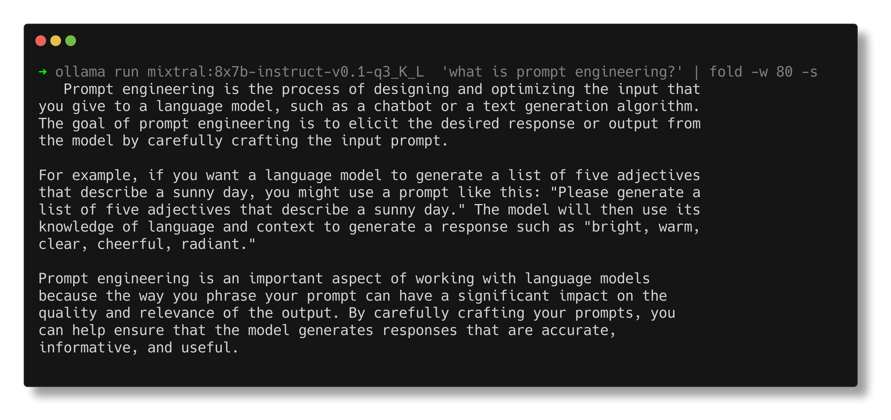
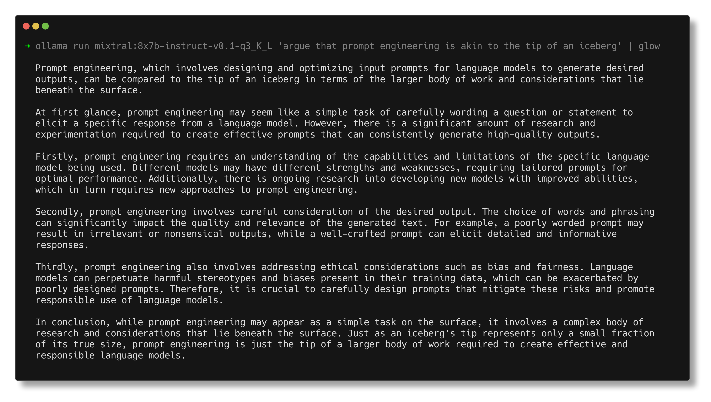

# UBL Writing Day 2024 Prompt Engineering

> Input session on 2024-02-29, Leipzig University Library, [Martin
> Czygan](mailto:martin.czygan@gmail.com), software developer, author and data
> engineer

## About Me

* Software Developer at [Leipzig University
  Library](https://ub.uni-leipzig.de), Open Data Engineer at [Internet
Archive](https://archive.org), working on [Internet Archive
Scholar](https://en.wikipedia.org/wiki/Internet_Archive_Scholar) and [Citation Graphs](https://arxiv.org/abs/2110.06595)

[](https://scholar.archive.org)

* Misc: consultant,
  [author](https://scholar.google.com/citations?user=7gueY4EAAAAJ), open source
[contributor](https://github.com/miku), community
[organizer](https://golangleipzig.space/), former Lecturer at [Lancaster
University](https://www.lancasterleipzig.de/) Leipzig
* main "serious" topic, beside
  [haikus](https://golangleipzig.space/meetup-38-llm-haiku/meetup-38-llm-haiku.pdf),
is the conversion of unstructured data (e.g. "strings", "bytes") to structured data
(e.g. "metadata"), information retrieval
* previous talks: [NN tour](https://github.com/miku/nntour) (2016), [PyTorch tour](https://github.com/miku/pytorch-tour) (2018), [ML w/ Go](https://github.com/miku/mlgo) (2018), [cgosamples](https://github.com/miku/cgosamples) (2023), [local
  models](https://github.com/miku/localmodels) (2023)

## From black boxes to open models (and back)

> But there is frustration in the science community over OpenAI's secrecy
> around how the model was trained and what data were used, and how GPT-4
> actually works. "**All of these closed-source models, they are essentially dead
> ends in science**," says [Sasha Luccioni](https://www.sashaluccioni.com/), a research scientist specializing in
> climate at HuggingFace, an open-source AI cooperative. --
> [GPT-4 IS HERE: WHAT SCIENTISTS THINK](http://www.hajim.rochester.edu/che/assets/pdf/gpt-4-is-here-what-scientists-think.pdf) (03/2023)

* local models offer better accessibility, transparency, privacy, allow more experimentation, etc.
* NVIDIA released a local "Chat with your documents" application for Windows: [Chat with RTX](https://blogs.nvidia.com/blog/chat-with-rtx-available-now/) on February 13, 2024

Making models and tools **open** can also be used as "marketing tactic" by
VC-funded companies to gain traction, etc.

## Prompt engineering

* the wikipedia article about [Prompt
  Engineering](https://en.wikipedia.org/wiki/Prompt_engineering) is not that old, it first appeared in
[2021-10-20](https://en.wikipedia.org/w/index.php?title=Prompt_engineering&oldid=1050870205), a Wednesday
* I used tweet [1599971348717051904](https://twitter.com/alexandr_wang/status/1599971348717051904) as a joke on 2022-12-12 during an intro to programming CS class

What an LLM thinks about PE:



These language models learn are META-LEARNERS:

> language models can also be understood as meta-learners where slow
outer-loop gradient descent based learning is combined with **fast "in-context"
learning implemented within the context activations of the model** -- [Language Models are Few-Shot Learners](https://proceedings.neurips.cc/paper/2020/file/1457c0d6bfcb4967418bfb8ac142f64a-Paper.pdf)

This is new and only observed in larger models. We not only want a distribution
over words, but "words and tasks".

> Learning to perform a single task can be expressed in a
probabilistic framework as estimating a conditional distribution
`p(output|input)` . Since a general system should be able to perform many
different tasks, even for the same input, **it should condition not only on the
input but also on the task to be performed**. That is, it should model
`p(output|input, task)`. -- [Language Models are Unsupervised Multitask Learners](https://d4mucfpksywv.cloudfront.net/better-language-models/language_models_are_unsupervised_multitask_learners.pdf)

## Is it in-context learning or memorization?

> LLMs struggle with generalization (the only thing that actually matters),
> due to being entirely reliant on memorization -- [François Chollet](https://twitter.com/fchollet/status/1755250582334709970)


## Previously

An LLM resembles classic systems and there are some milestones along the way.

## Classic language models, writing and chat tools

In the June 1989 issue of Scientific American, on page 122-125, we find a
column, titled [A potpourri of programmed prose and
prosody](https://archive.org/details/ComputerRecreationsMarkovChainer):

[](https://archive.org/details/ComputerRecreationsMarkovChainer)

It takes about 10s on a CPU to create a language model from 400K words, using
a slightly strange combination of texts, e.g. bible, python docs, etc.

Example output:

```shell
$ python gentext.py

with likewise the itertools module the result gives total ordering its
generally true that am the lord when thy days that were numbered of them as he
goeth in to wait for enqueued tasks have completed before ascompleted is called
without calling sysexcinfo bpo allow the creation of new features related to
fifo false if pattern is relative and then sort again
```

Example training and text generation with more data: [Screenie](x/markov/641812.gif).

Other example of programmatic text generation:

* [https://kingjamesprogramming.tumblr.com/](https://kingjamesprogramming.tumblr.com/)

> Posts generated by a Markov chain trained on the King James Bible, Structure
> and Interpretation of Computer Programs, and some of Eric S. Raymond's
> writings Run by Michael Walker (barrucadu).

* [SCIgen](https://pdos.csail.mit.edu/archive/scigen/) - An Automatic CS Paper Generator (2005)
* [Eliza](https://web.stanford.edu/class/cs124/p36-weizenabaum.pdf) (1966)

Latent-space navigation.

> Crucially, in-context learning happens only at inference time without any
> parameter updates to the model.

Context-window refers to the number of words (or tokens) the model is able to
take into account (gpt-2: 1024, llama2: 4096, ...)

Examples:

```
maison: house
chat: cat
dog: ...
```

How much of that in context learning is actually learning (not remembering)?
Cf. [What Can Transformers Learn In-Context? A Case Study of Simple Function
Classes](https://arxiv.org/pdf/2208.01066.pdf), or [Prompt Programming for
Large Language Models: Beyond the Few-Shot
Paradigm](https://arxiv.org/pdf/2102.07350.pdf)

> Rather than instruction, the method’s primary function is task location in
> the model's existing space of learned tasks. This is evidenced by the
> effectiveness of alternative prompts which, with no examples or instruction,
> can elicit comparable or superior perfor- mance to the few-shot format.

What affects in-learning performance? Cf. [Rethinking the Role of
Demonstrations: What Makes In-Context Learning
Work?](https://arxiv.org/pdf/2202.12837.pdf)

> Despite in-context learning consistently outperforming zero-shot inference on
> a wide range of tasks, there is little understanding of how it works and
> which aspects of the demon- strations contribute to end task performance

It is an iceberg.


Let the LLM explain:


