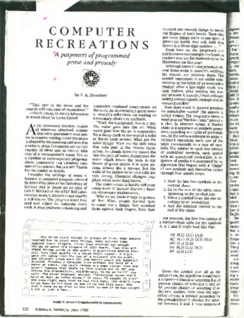

# UBL Writing Day 2024 Prompt Engineering

> Input session on 2024-02-29, Leipzig University Library, [Martin
> Czygan](mailto:martin.czygan@gmail.com), software developer, author and data
> engineer

## About Me

* Software Developer at [Leipzig University
  Library](https://ub.uni-leipzig.de), Open Data Engineer at [Internet
Archive](https://archive.org), working on [Internet Archive
Scholar](https://en.wikipedia.org/wiki/Internet_Archive_Scholar) and [Citation Graphs](https://arxiv.org/abs/2110.06595)

* Misc: consultant,
  [author](https://scholar.google.com/citations?user=7gueY4EAAAAJ), open source
[contributor](https://github.com/miku), community
[organizer](https://golangleipzig.space/), former Lecturer at [Lancaster
University](https://www.lancasterleipzig.de/) Leipzig
* main "serious" topic, beside
  [haikus](https://golangleipzig.space/meetup-38-llm-haiku/meetup-38-llm-haiku.pdf),
is the conversion of unstructured data (e.g. "strings", "bytes") to structured data
(e.g. "metadata"), information retrieval
* previous talks: [NN tour](https://github.com/miku/nntour) (2016), [PyTorch tour](https://github.com/miku/pytorch-tour) (2018), [ML w/ Go](https://github.com/miku/mlgo) (2018), [cgosamples](https://github.com/miku/cgosamples) (2023), [local
  models](https://github.com/miku/localmodels) (2023)

## A growing genai ecosystem

* in the last 12 months, a number of closed and open models have been released (there is a [spectrum](https://arxiv.org/pdf/2302.04844.pdf))
* large number of tools around models (often just thin wrappers)
* dozens of [writing assistants](https://github.com/steven2358/awesome-generative-ai?tab=readme-ov-file#writing-assistants), more integrated with writing tasks (ideation, readability, grammar checks, summarization, ...)
* tools to help find snippets in your own documents, locally (maybe: better search)

For programming, there are coding assistants. They can help to draft and
explore (e.g. new languages), but programming involves [more
tasks](https://pages.cs.wisc.edu/~remzi/Naur.pdf) than just writing it down.

According to a case study of 150M LOC, code quality already [dropped in
2023](https://gwern.net/doc/ai/nn/transformer/gpt/codex/2024-harding.pdf). We
**need less code not more**, and the copilots currently work in the opposite
direction.

One important step is the proliferation of open models (e.g. Meta's
[llama](https://ai.meta.com/blog/large-language-model-llama-meta-ai/)) and
tools that allow to run an LLM on your own machine (most of these notes are
informed by experiments with local models).

## Shiny, broken

* [Why we can't have nice software](https://andrewkelley.me/post/why-we-cant-have-nice-software.html)

> Prompt engineering is time consuming and requires considerable trial and
> error...As one developer said, "it's more of an art than a science".

## Why Prompt Engineering?

* interactions like chat w/ machine existed at least since [1967](https://web.stanford.edu/class/cs124/p36-weizenabaum.pdf) (57 years ago)
* natural language interfaces are not new
* the wikipedia article about [Prompt Engineering](https://en.wikipedia.org/wiki/Prompt_engineering) first appeared in [2021-10-20](https://en.wikipedia.org/w/index.php?title=Prompt_engineering&oldid=1050870205)
* there was a tweet [1599971348717051904](https://twitter.com/alexandr_wang/status/1599971348717051904) about the job role "Prompt Engineer" (I used it as a joke on 2022-12-12 during an intro to programming CS class)

The prompt serves as an input to a large language model.

## Small language models

Before they became large, there were small language models.

In the June 1989 issue of Scientific American, on page 122-125, we find a
column, titled [A potpourri of programmed prose and
prosody](https://archive.org/details/ComputerRecreationsMarkovChainer):

## Example Markov Chain Output

* example
* it contains both usable parts (some, few, ...)
* all it models is the probability of the next word in the sequence (the same task of an LLM)

## Word Vectors

* important step towards modelling meaning of words and text
* assign a vector (e.g. of dim 100) to a word, and your vocabulary will live in a vector space, that exposes operations on it, e.g. similarity between words, arithmetic, ...
* the learning of the vectors is based on a NN trying to predict the next word (or the context of a word)
* unsupervised task, no need for labor-intensive labeling, large training sets available ([The Pile](https://arxiv.org/abs/2101.00027), ...)
* given some input, e.g. 1M words, let's see what relations

## Steps towards Prompt Engineering

* insert screenie here "4 levels"

## What is this activity?

* navigation (in a latent space of NN)
* in-context learning

## Techniques

From: [Building Your Own Product Copilot: Challenges, Opportunities, and
Needs](https://arxiv.org/pdf/2312.14231.pdf)

> Recently, a lot of frameworks have been proposed to help with
prompt engineering. These frameworks aim to provide reusable
and modular components that can simplify the process of designing
and executing prompts for various tasks and models. Two common
components are prompt chaining [22 , 23 ] and prompt templates [ 12].
Prompt chaining is a technique that involves feeding the output of
one prompt as the input of another prompt, creating a sequence
of prompts that can perform complex and multi-step tasks. For
example, one can chain a prompt that extracts keywords from a
document with another prompt that generates summaries based on
those keywords. Prompt templates are pre-defined structures that
can be filled with specific values or variables to create customized
prompts for different tasks and domains. For example, one can
use a template that asks a question and expects an answer in a
certain format and then fill it with different questions and formats
depending on the task. These components can help developers to
create more effective and robust prompts for their applications.
